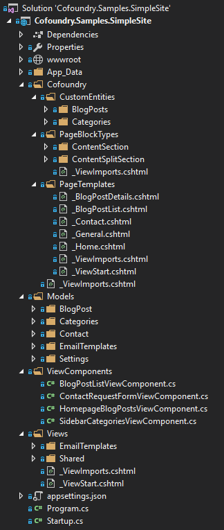

# Cofoundry.Samples.SimpleSite

A simple website implementing content management and some framework features including:

- Startup registration
- Page Templates
- Custom Page Blocks
- Image content
- Three custom entities - blog post, authors and category
- Querying and display a list of blog posts
- A blog post custom entity details page
- A simple contact form
- Email notifications & Email Templating
- Custom error pages
- Configuration Settings

#### To get started:

1. Create a database named 'Cofoundry.Samples.SimpleSite' and check the Cofoundry connection string in the appsettings.josn file is correct for you sql server instance
2. Run the website and navigate to *"/admin"*, which will display the setup screen
3. Enter an application name and setup your user account. Submit the form to complete the site setup. 
4. Either log in and enter your own data or follow the steps below to import some test data

#### Importing test data:

To get you started we've put together some optional test data:

1. Run `InitData\Init.sql` script against your db to populate some initial pages and blog posts
2. Copy the images from *"\InitData\Images"* to *"\src\Cofoundry.Samples.SimpleSite\App_Data\Files\Images"*
3. Either restart the site, or go to the *settings* module in the admin panel and clear the cache.

## App Overview

This is a simple company website that includes several content managed pages, a blog and a contact form.

### Managing Content

Cofoundry has a back-office administration panel that is used to manage the majority of content and settings, but there is also an in-page *visual editor* that allows you to manage page content as you browse the site. 

#### Visual Editor

If you've installed the test data and logged in, you will be able to navigate the site and see the *visual editor toolbar* at the bottom of the screen, which contains buttons that let you *edit*, *preview* and *publish* pages and blog posts as you browse the site. 

Click on the **Edit Draft** button to start editing.

When in edit mode, regions of the page are highlighted and become editable, allowing content to be added. These editable regions are declared in a *page template*, which is simply a razor .cshtml file placed in a specific location in your solution.

For more information about pages take a look at the [pages](https://github.com/cofoundry-cms/cofoundry/wiki/Pages) and [page template](https://github.com/cofoundry-cms/cofoundry/wiki/Page-Templates) documentation.

#### Admin Panel

The visual editor is good for editing page content, but to manage the website structure and configure content and settings you'll need to log in to the admin panel, to do this navigate to **/admin**.

The main parts of the admin panel we're interested in for this example are the *Pages* region and the *Blog Posts* region.

*Pages* allows us to manage the dynamic pages in the website site, while *Blog Posts* lets you manage article content. Blogging functionality isn't included by default in Cofoundry, instead we've used the flexible **Custom Entity** framework to create a *Blog Post* and *Category* type. 

*Custom Entities* are defined in code by writing a couple of class files. For more detailed information on this check out the [custom entities documentation](https://github.com/cofoundry-cms/cofoundry/wiki/Custom-Entities).

### Code

In this example we've tried to keep things simple and have put all the code into a single project. For more complex applications you'll probably want to split out some of this logic and data access into one or more layers,  [Cofoundry.Samples.SPASite](https://github.com/cofoundry-cms/Cofoundry.Samples.SPASite) is a more structured example that demonstrates one way you might choose do this.

- **Cofoundry:** In this example we put all Cofoundry templates, block types and custom entity definitions in a special Cofoundry folder to keep them separate, but the templates can also go in the Views folder if that feels more natural to you. The code files can be placed anywhere.
- **Content:** This is where you'll find the css for the project. Styling has been kept to a minimum in this example to keep things simple.
- **Models:** The models folder contains some basic view models and two examples of Cofoundry features. An email template model demonstrates the [Mail framework](https://github.com/cofoundry-cms/cofoundry/wiki/Mail) and a settings model demonstrates the [strongly typed settings feature](https://github.com/cofoundry-cms/cofoundry/wiki/Configuration-Settings).
- **ViewComponents:** Although the pages are dynamic, we use *ViewComponents* to include some functionality such as the blog post listing and the contact form action. These component files contain the server-side code for these features.
- **Views:** In this project the page templates are defined in the *Cofoundry/PageTemplates* folder, but partials, layouts and view component views are still located in the normal views folder.
- **Startup.cs:** [Cofoundry startup and registration](https://github.com/cofoundry-cms/cofoundry/wiki/Website-Startup) is handled in the startup.cs file. Page routing in this example is handled by Cofoundry, but you [can also specify asp.net routes](https://github.com/cofoundry-cms/cofoundry/wiki/Routing) if you want.
